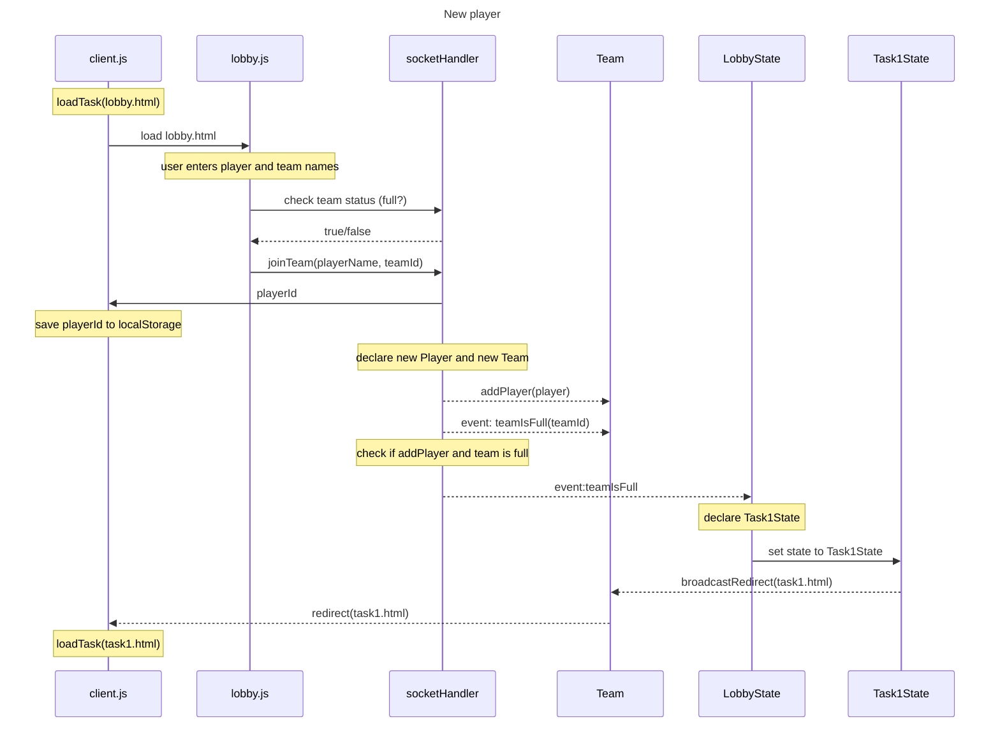

```mermaid
sequenceDiagram
    title New player

    participant client.js
    participant lobby.js
    participant socketHandler
    participant Team
    participant LobbyState
    participant Task1State

    note over client.js:loadTask(lobby.html)
    client.js->>lobby.js:load lobby.html
    note over lobby.js:user enters player and team names
    lobby.js->>socketHandler:check team status (full?)
    socketHandler-->>lobby.js:true/false
    lobby.js->>socketHandler:joinTeam(playerName, teamId) 
    socketHandler->>client.js:playerId
    note over client.js:save playerId to localStorage
    note over socketHandler:declare new Player and new Team
    socketHandler-->>Team:addPlayer(player)
    socketHandler-->>Team:event: teamIsFull(teamId)
    note over socketHandler: check if addPlayer and team is full
    socketHandler-->>LobbyState:event:teamIsFull
    note over LobbyState:declare Task1State
    LobbyState->>Task1State:set state to Task1State
    Task1State-->>Team:broadcastRedirect(task1.html)
    Team-->>client.js:redirect(task1.html)
    note over client.js:loadTask(task1.html)
```